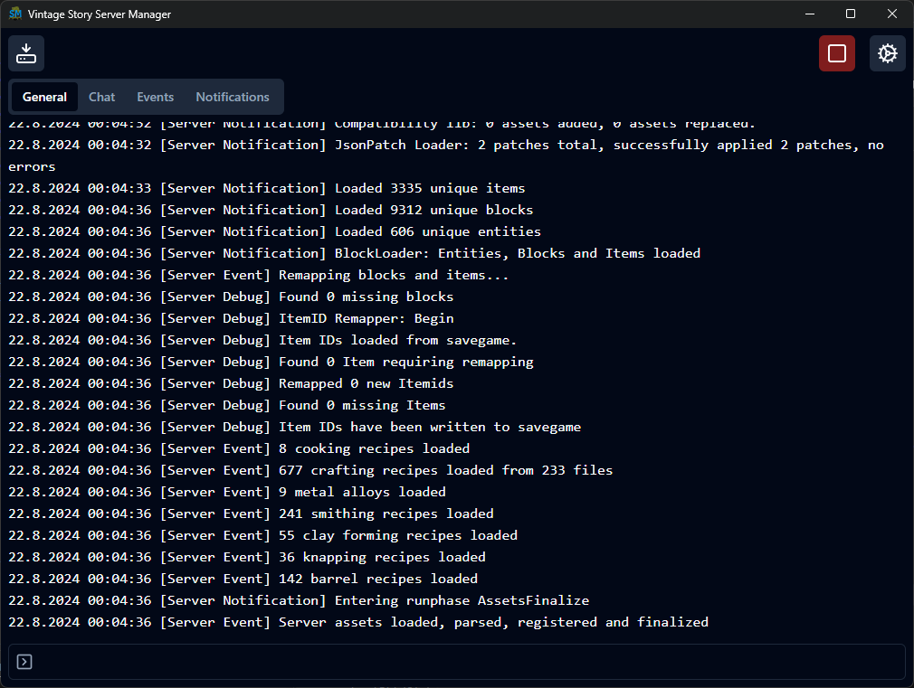

# Vintage Story Server Manager

Little GUI app for a Vintage Story server.

Features:

- Splitting logs into general, chat, notification and event tabs.
- Start/stop button
- Creating backup with single button
- Automatic backups every X hours

The server is launched using a `VintageStoryServer.dll` (Not .exe because of plans to ship this to Linux), therefore requires .NET installed on user's machine. App will try to detect if it's installed and if no then offer a little help on how to do it and even offer an automatic install using [install script](https://learn.microsoft.com/en-us/dotnet/core/tools/dotnet-install-script).

Server's data path and port can be set in preferences dialog. Without setting data path the server won't start. Port is 42420 by default and can be left empty.

### What will come next

- Automatic app version update
- Logs filtering by date & time
- Custom tabs creation (based on channel, or maybe regexp for advanced users)
- Commands autocomplete when typing "/", with some docs based on wiki
- Multiple servers support?
- Automatic install of the server dll based on selected version?
- Mods support?

### Note

I'm primarily creating this for myself and don't have any schedule. If you've somehow stumbled upon this repo and planning to use the app then please message me or create an issue if you found something or have an idea of an improvement. Will be happy to hear some feedback or simply chat.
